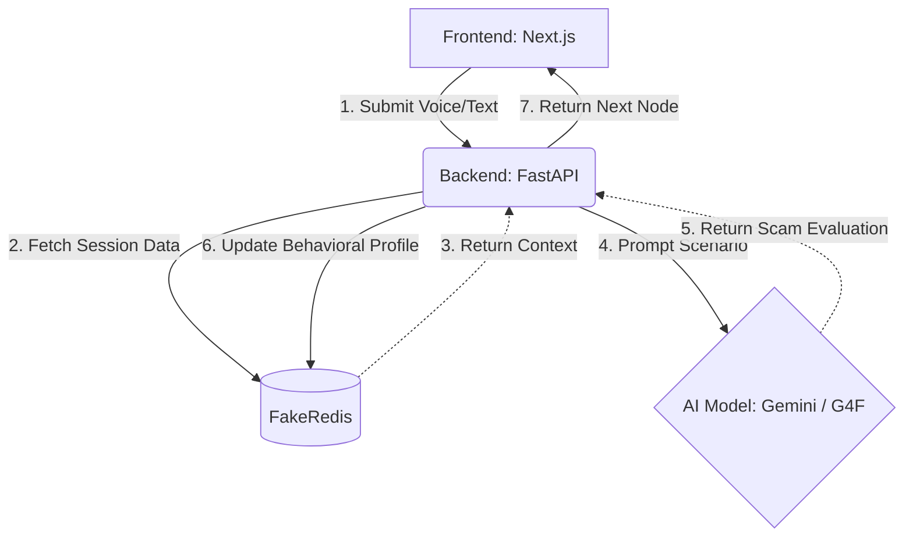

# THEMIS - Fraud Inoculation Simulator

[](https://themis-azure.vercel.app/)

An interactive, multilingual cyber awareness platform designed to inoculate users against modern fraud and manipulation tactics. Through voice and text simulators, behavioral profiling, and global threat monitoring, THEMIS prepares users to recognize and combat sophisticated threats before they happen.

---

## 🔒 Core Capabilities

| Feature | Description | Status |
|---------|-------------|--------|
| **Voice Simulator** | Real-time AI voice roleplay (powered by Gemini/G4F) | ✅ Active |
| **Text Simulator** | SMS and Email phishing scenario analysis | ✅ Active |
| **Multilingual Support** | Full support for English, Hindi, Tamil, Telugu, and Malayalam | ✅ Active |
| **Behavioral Profiling** | Generates tactical vulnerability reports per user | ✅ Active |
| **Threat Dashboard** | Live monitoring of global scam trends | ✅ Active |

---

## 🛠️ Tech Stack

- **Frontend:** Next.js (App Router) + TypeScript + Tailwind CSS (Brutalist UI)
- **Animations:** Framer Motion + custom Matrix canvas effects
- **Backend:** FastAPI (Python) deployed on Render
- **AI Integration:** Google Gemini 2.5 Flash / GPT4Free
- **Database / Cache:** SQLite & FakeRedis

---

## 📐 Architecture & Core Workflows



---

## 🚀 Running Locally

### Prerequisites
- Node.js 18+
- Python 3.10+
- npm & pip

### Steps

```bash
# 1. Clone the repository
git clone https://github.com/abdulhaashiras-coder/Themis---Alt.git
cd Themis---Alt

# 2. Start the Backend (FastAPI)
cd backend
pip install -r requirements.txt
uvicorn main:app --reload --port 8000

# 3. Start the Frontend (Next.js)
# Open a new terminal tab
cd frontend
npm install
npm run dev
```

The frontend will be available at `http://localhost:3000` and the backend at `http://localhost:8000`.

---

## 🔑 Backend Connection

The frontend Next.js application connects to the Python FastAPI backend to process AI generations and behavioral profiling. In production, this is hosted on a secure Render instance. The API URL is configured via the `NEXT_PUBLIC_API_URL` environment variable in the frontend.

---

## 📁 Key Directories

| Directory/File | Purpose |
|--------------|---------|
| `/frontend/src/app` | Next.js App Router pages (Dashboard, Learn, Quiz, Reports) |
| `/frontend/src/components` | Reusable React components including the Simulators and Navbar |
| `/backend/main.py` | Core FastAPI application handling AI prompting and database logic |
| `/backend/mock_data.py` | Translated scenario trees for the interactive text/voice simulations |
